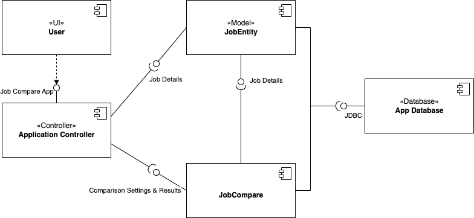

# Design Document

**Author**: Puneeth, Feng and Alex

## 1 Design Considerations

### 1.1 Assumptions
Current android app is developed using the features and API of Android 12. The app will be backward compatible to Android 8.0 (API level 26). 
The app in intended to be used by people of age above 15 in all countries on android platform only. The app should not show any ads in the UI.
Android app developers need to ensure that their apps have an intuitive and user-friendly UI and provide an excellent user experience. 
This may require testing and optimizing the app's design and functionality. The app will be for a single user.

### 1.2 Constraints
- **Technical Constraints:** Technical constraints can impact the design of a system, such as hardware limitations or compatibility issues.
  - The design must run using the resources of a single Android system, and should be optimized to ensure compatibility across common devices.
  - App will be developed using the Java language using Android Studio 3.0+.
  - The persistence layer will be using SQLite and a relation mapping library ORMLite.
- **User Constraints:** User constraints can impact the design of a system, such as the need to accommodate users with disabilities or language barriers. 
  - As this is a single user system, the design does not need to consider any user constraints outside of the standard user experience.

### 1.3 System Environment
- The developed application is primarily tested on below hardware and software platforms:
  - Hardware : Pixel 4 XL
  - Software : Android 12 (API level 31) 	 	

## 2 Architectural Design
### 2.1 Component Diagram
>>
There are five components in the system. The user interacts with the system through user application controller, which allows the user to make various actions and provides the results back to the user. On the backend, the JobEntity component provides details about the job saved for comparison. JobCompare will return the results of comparison to frontend. All job information saved by the user will be stored in the application database. \

### 2.2 Deployment Diagram
A deployment diagram is unnecessary for this solution, as the solution is intended for use by a single user on a single system with no communication between systems. This is stated in the requirements document as requirement 8: "you may assume there is a single system running the app (no communication or saving between devices is necessary)". This solution will run entirely on a single Android device.

## 3 Low-Level Design
### 3.1 Class Diagram

[Design Description](../design-description.md)

## 4 User Interface Design
Balsmiq Wireframes tools is used to develop the mockup of the application UI.\
[User Interface Mockup](./wireframe.pdf)

 