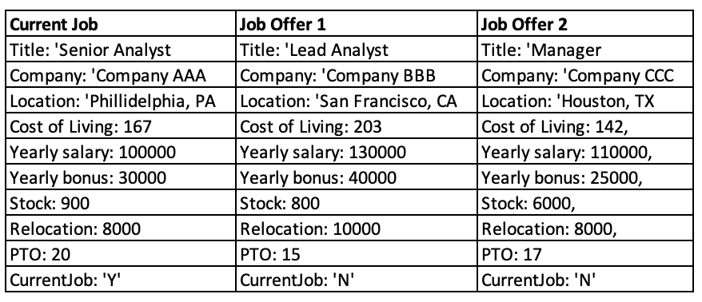
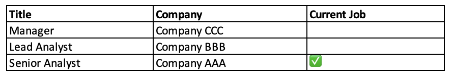
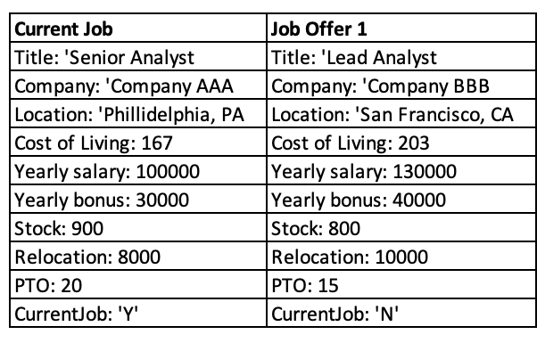
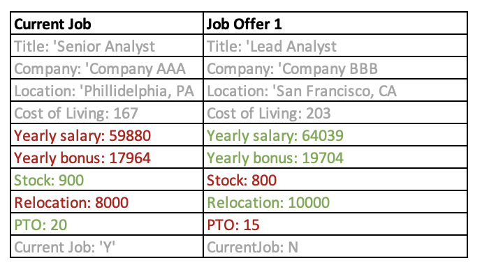

# Test Plan

*This is the template for your test plan. The parts in italics are concise explanations of what should go in the corresponding sections and should not appear in the final document.*

**Author**: \<person or team name\>

## 1 Testing Strategy

### 1.1 Overall strategy

*This section should provide details about your unit-, integration-, system-, and regression-testing strategies. In particular, it should discuss which activities you will perform as part of your testing process, and who will perform such activities.*
-
- Alex
- 
- unit test strategy
- system test str ategy
- integration test not needed ...
- regression testing not needed ...

Testing of the Job Comparison app will primarily be performed using a combination of white and black box testing, with additional unit level verification potentially provided by reviews and walkthroughs.
- Unit testing will be developed by class, with tests verifying intended functionality that is internal to said class. 
- Integration testing will focus on the compare job functionality and will assume jobs and settings are previously populated by the user. As the proposed system is relatively simple, this is the only integration test planned.
- System testing will cover the full system, emulating the user from first opening the app through successful job comparison. It will also include adjusting of the ComparisonSettings parameters prior to executing the comparison.
- Regression testing will use the full test suite defined for solution development which can be re-run and updated as additional features are requested and failures are resolved.

There will be significant overlap of integration testing and system testing based on the overall test strategy discussed here. As tests are developed, integration testing may be absorbed into system testing, with no subsystems remaining that warrant discrete integration testing.

### 1.2 Test Selection

*Here you should discuss how you are going to select your test cases, that is, which black-box and/or white-box techniques you will use. If you plan to use different techniques at different testing levels (e.g., unit and system), you should clarify that.*
- 
- Feng
- 
- test selection methods
- unit: white and black box
- system: black box

For unit test, both black-box test and white-box test will be applied. Black-box test is used to test whether each unit functions as expected. White-box test is used to identify errors in the corresponding codes. 

For system test, black-box test will be applied to check whether the system meets the specified requirement and works correctly as expected. 

### 1.3 Adequacy Criterion

*Define how you are going to assess the quality of your test cases. Typically, this involves some form of functional or structural coverage. If you plan to use different techniques at different testing levels (e.g., unit and system), you should clarify that.*
- 
- Puneeth
- 
- code coverage of test cases
### 1.4 Bug Tracking

*Describe how bugs and enhancement requests will be tracked.*

GitHub projects will be used for bug tracking and managing enhancement requests. As this is a single user app, communication from the user will be direct to the development team with the Project Manager coordinating communication. Two projects have been created on the 6300Spring23Team057 repository for this purpose.

### 1.5 Technology

*Describe any testing technology you intend to use or build (e.g., JUnit, Selenium).*
- Junits/Mockito will be used for Unit testing
- Espresso will used for UI and System testing

## 2 Test Cases

*This section should be the core of this document. You should provide a table of test cases, one per row. For each test case, the table should provide its purpose, the steps necessary to perform the test, the expected result, the actual result (to be filled later), pass/fail information (to be filled later), and any additional information you think is relevant.*

### Unit Test Cases (JUnit)
| Test Case # | Purpose | Scope  | Inputs | Steps | Expected Result  | Actual result | Pass / Fail |
|-------------|---------|--------|--------|-------|------------------|---------------|-------------|
| 1           | present ranked list for all jobs saved when user click on compare job offers in main menu   | Compare Jobs   |    | 1.click on job offer compare button from main menu    | display ranked list of tile and company for all saved jobs by descending scores and current job should be clearly indicated              |               |             |\
| 2           | compare two job offers from the ranked list  | Compare Jobs   |    | 1.select two jobs from the list 2.click on compare button    |                |               |             |\
| 5           | compare the entered job offer with current job saved | Compare Jobs   |     | 1.click on compare button from job offer page (current job needs to be added and saved)    |               |               |             |

### System Test Cases (UI)
| Test Case # | Purpose | Scope  | Inputs | Steps | Expected Result  | Actual result | Pass / Fail |
|-------------|---------|--------|--------|-------|------------------|---------------|-------------|
| 1           | sdokm   | asd    | asd    | asd   | asd              |               |             |\
| 3           | return to main menu from result page of compare job  | Compare Jobs   | N/A    | 1.click on return to main menu button on the result page    | return to main menu             |               |             |\
| 4           | perform another job offer comparison from result page of compare job  | Compare Jobs   | N/A    | click on return to perform another job offer comparison button on the result page   | return to the page of ranked list of all jobs         |               |             |\
| 6           | compare the entered job offer without current job saved  | Compare Jobs   | N/A    | click on compare button from job offer page (no current job saved)    | error message             |               |             |

- job offer - Puneeth
- compare job - Feng
- current job - Yiliang
- job compare settings - Puneeth
- app controller - Alex