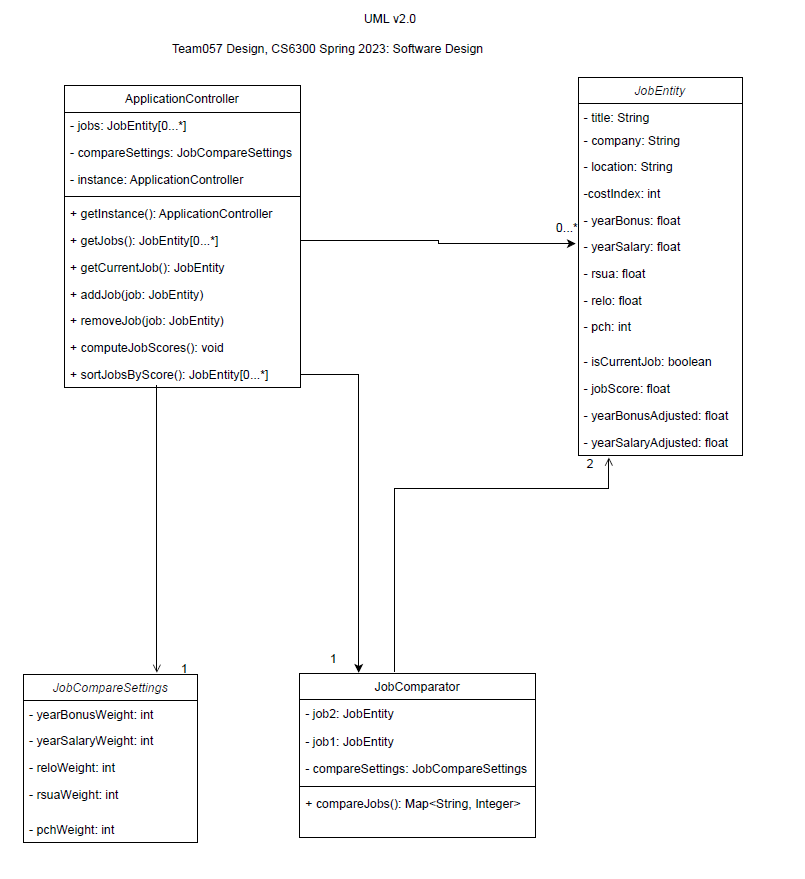

# Design Discussion Document

## Design 1
 
Author: fgao36

### Pros
* Clear entry point into the application
* Design is per UML standard

### Cons
* UI classes are included in the class diagram
* Class defined in UserMainMenu called "RankingWeight" which is not defined

## Design 2
 
Author: abayer3

### Pros
* Clear entry point into the application
* Classes in diagram cover all requirements

### Cons
* createJob method returns a string instead of a job
* Many of the methods in the design are UI methods and not relevant to the class diagram
* Class diagram is lacking association cardinality

## Design 3
 
Author: ychen3647

### Pros
* Simple design
* Clear Entry Point

### Cons
* Doesn't cover all requirements given
* User class is empty
* No relevant methods in diagram

## Design 4
 
Author: preddy61

### Pros
* Covers all requirements given
* Clear entry point to the application
* Complete design including methods, data types, and class associations

### Cons
* Design may be too complex for the simple application needed

## Team Design
 
Author: Team 057

The team design is based primarily on the design of Puneeth (preddy61, design 4)
which was one of the most complete class diagram of the individual designs. A few
changes were made from design 4 and the team design, including was condensing the
three entity classes into a single class called JobEntity, and removing the 
JobCompareResult class. The single job entity class is in line with the other three
designs which each used a single class to represent jobs. Removing the JobCompareResult
removed a level of encapsulation that wasn't needed once the job entity classes were
collapsed into a single class. The team design also uses a separate class to hold the
settings or weights for job comparisons which is common the same structure used in
three of the four individual designs. The team design also adds an association between
ApplicationController and JobComparator which was not represented well in any of
the individual designs.

## Summary
Comparing individual designs gave an opportunity for differing design perspectives 
to be considered which allowed for better end state design. We found that the intent
of the requirements could be met in a variety of ways, and the final design was 
a result of both the requirement from the customer and our design preferences as a
team. We had greatly differing designs resulting from the same requirements, varying in 
complexity and which keywords got picked to be classes. In a team setting, we learned from
angles that we never thought of before. We also learned that it is best to consult
within a team to balance between over-simplification and over-engineering. 
In general for software development in a team it would be useful for the team 
to develop unique designs before collaborating to a final design as was done for this
assignment. The experience of some team members was also very beneficial in refining 
the team's ideas into a polished and complete UML class diagram, and the perspectives
of the other team members with less experience added novel ideas to the design.
