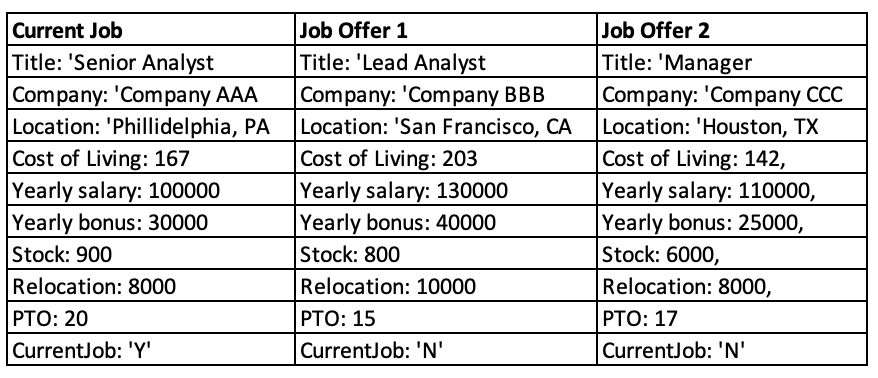
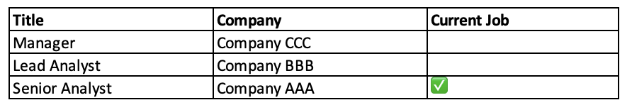
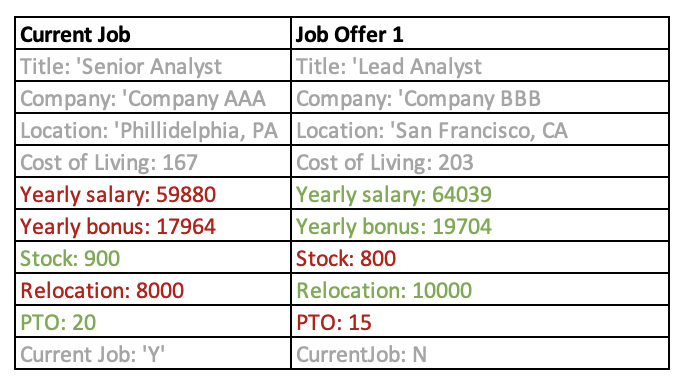

# Test Plan

**Author**: Puneeth, Feng, Yiliang, Alex

## 1 Testing Strategy

### 1.1 Overall strategy
Testing of the Job Comparison app will primarily be performed using a combination of white and black box testing, with additional unit level verification potentially provided by reviews and walkthroughs.
- Unit testing will be developed by class, with tests verifying intended functionality that is internal to said class. 
- Integration testing will focus on the compare job functionality and will assume jobs and settings are previously populated by the user. As the proposed system is relatively simple, this is the only integration test planned.
- System testing will cover the full system, emulating the user from first opening the app through successful job comparison. It will also include adjusting of the ComparisonSettings parameters prior to executing the comparison.
- Regression testing will use the full test suite defined for solution development which can be re-run and updated as additional features are requested and failures are resolved.

There will be significant overlap of integration testing and system testing based on the overall test strategy discussed here. As tests are developed, integration testing may be absorbed into system testing, with no subsystems remaining that warrant discrete integration testing.

### 1.2 Test Selection
For unit test, both black-box test and white-box test will be applied. 
- Black-box test is used to test whether each unit functions as expected and partition testing technique will be used to check whether the outputs are correct or whether the component can generate corresponding error messages when inputs do not meet the specified criteria. 
- White-box test is used to identify errors in the corresponding codes. Statement coverage technique will be used to examine all the statements in the code. 

For system test, black-box test will be applied to check whether the system meets the specified requirements. 
- Partition testing technique will be used to test whether the system generates correct results.
- State transition testing technique will be used to examine whether the system transit among pages as specified. 

### 1.3 Adequacy Criterion
All the model and controller classes will be tested using JUnit and the system/functional tests will be performed using UI testcases. The test cases should cover all requirements or functionalities of the system being tested including both positive and negative scenarios. Android code coverage report will be used to assess the quality of the test cases. 

### 1.4 Bug Tracking
GitHub projects will be used for bug tracking and managing enhancement requests. As this is a single user app, communication from the user will be direct to the development team with the Project Manager coordinating communication. Two projects have been created on the 6300Spring23Team057 repository for this purpose.

### 1.5 Technology
- JUnit/Mockito will be used for Unit testing
- Espresso will used for UI and System testing

## 2 Test Cases
### Unit Test Cases (JUnit)
| Test Case # | Purpose                                                                                   | Scope                                        | Inputs                                                                                                                                                                                                                                                                                                                                                                         | Steps                                                                                              | Expected Result                                                                                                                                                                                                                                                       | Actual result | Pass / Fail |
|-------------|-------------------------------------------------------------------------------------------|----------------------------------------------|--------------------------------------------------------------------------------------------------------------------------------------------------------------------------------------------------------------------------------------------------------------------------------------------------------------------------------------------------------------------------------|----------------------------------------------------------------------------------------------------|-----------------------------------------------------------------------------------------------------------------------------------------------------------------------------------------------------------------------------------------------------------------------|---------------|-------------|
| 1           | test getJobs()                                                                            | ApplicationController                        | 0-n JobEntity instances                                                                                                                                                                                                                                                                                                                                                        | 1. call getJobs()                                                                                  | 0-n JobEntity instances                                                                                                                                                                                                                                               |               |             |
| 2           | test getCurrentJob()                                                                      | ApplicationController                        | 0-n JobEntity instances, one with isCurrentJob = True                                                                                                                                                                                                                                                                                                                          | 1. call getCurrentJob()                                                                            | JobEntity with isCurrentJob = True                                                                                                                                                                                                                                    |               |             |
| 3           | test addJob(...)                                                                          | ApplicationController                        | list of arguments matching JobEntity parameters                                                                                                                                                                                                                                                                                                                                | 1. call addJob(inputs) 2. call getJobs()                                                       | - JobEntity(inputs) in getJobs() return - <=1 JobEntity with isCurrentJob = True                                                                                                                                                                                  |               |             |
| 4           | test removeJob(...)                                                                       | ApplicationController                        | 1. 0-n JobEntity instances 2. JobEntity ID \[0-n JobEntity]                                                                                                                                                                                                                                                                                                                | 1. call removeJob(input2) 2. call getJobs()                                                    | JobEntity(input) is not in getJobs() return                                                                                                                                                                                                                           |               |             |
| 5           | test computeJobScores()                                                                   | ApplicationController, JobCompareSettings    | 1. 0-n JobEntity instances with linked scores 2. JobCompareSettings                                                                                                                                                                                                                                                                                                        | 1. call computeJobScores()                                                                         | computeJobScores() return = input1                                                                                                                                                                                                                                    |               |             |
| 6           | test sortJobsByScore()                                                                    | ApplicationController                        | 1. 0-n JobEntity instances with linked scores 2. 0-n JobEntity instances sorted by linked scores                                                                                                                                                                                                                                                                           | 1. call sortJobsByScore()                                                                          | sortJobsByScore() return = input2                                                                                                                                                                                                                                     |               |             |
| 7           | test Job Offer UI                                                                         | Job Offer                                    | All input fields in Job creation screen                                                                                                                                                                                                                                                                                                                                        | 1\. Key in all the fields required for the Job offer in the UI 2\. Tap Save button              | 1\. Entered Job Offer must be stored in the database. A feedback is given to the user 2\. Dialog with Options "Add another Job Offer" , "Compare with Current Job" (shown only if there is current job in the database) and "Go to Main Menu" is displayed      |               |             |
| 8           | test Job Offer UI                                                                         | Job Offer                                    | Title field is empty                                                                                                                                                                                                                                                                                                                                                           | 1\. Leave one of the fields empty in the Job offer UI screen. For e.g  Title is left empty         | 1\. Save button must be disabled and the relevant error must be shown in the UI e.g "Title" cannot be blank                                                                                                                                                           |               |             |
| 9           | test Job Offer UI                                                                         | Job Offer                                    | Title, Company, Location (entered as city and state), Cost of living in the location (expressed as an index), Yearly salary, Yearly bonus, Restricted Stock Unit Award (expressed as a lump sum vested over 4 years), Relocation stipend (A single value from $0 to $25,000), Personal Choice Holidays (A single overall number of days from 0 to 20), | 1\. Enter few fields and push the app to the background and bring it back                          | 1\. The entered data must be retained in the screen. The state of the screen must be same as it was before pushing the app to the background                                                                                                                          |               |             |
| 10          | test Job Offer UI                                                                         | Job Offer                                    | Title, Company, Location (entered as city and state), Cost of living in the location (expressed as an index), Yearly salary, Yearly bonus, Restricted Stock Unit Award (expressed as a lump sum vested over 4 years), Relocation stipend (A single value from $0 to $25,000), Personal Choice Holidays (A single overall number of days from 0 to 20), | 1\. Enter the Job offer UI screen and key in a few fields 2\. Tap Cancel button                 | 1\. The entered data must not be stored in the database. The Main screen should be displayed to the User.                                                                                                                                                             |               |             |
| 11          | test Job Offer UI                                                                         | Job Offer                                    | Cost of living in the location (expressed as an index), Yearly salary, Yearly bonus, Restricted Stock Unit Award (expressed as a lump sum vested over 4 years), Relocation stipend (A single value from $0 to $25,000), Personal Choice Holidays (A single overall number of days from 0 to 20),                                                                | 1\. Enter non-integer/float values in the input fields                                          | 1\. UI should not allow the user to enter the noninteger/ float values in the specified fields                                                                                                                                                                        |               |             |
| 12          | test Job Compare Settings                                                                 | Job Compare Settings                         | Yearly salary Yearly bonus Restricted Stock Unit Award Relocation stipend Personal Choice Holidays                                                                                                                                                                                                                                                                 | 1\. Select Job compare settings from the main screen                                               | 1\. User is shown the compare settings screen. Each of the fileds is associated with a slider from 1 to 5 as min/max values. 2\. All the fields must be set to 1 initially                                                                                      |               |             |
| 13          | test Job Compare Settings                                                                 | Job Compare Settings                         | Yearly salary Yearly bonus Restricted Stock Unit Award Relocation stipend Personal Choice Holidays                                                                                                                                                                                                                                                                 | 1\. Key in all the fields required for the Job compare settings in the UI 2\. Tap Cancel button | 1\. The entered data must not be stored in the database. The Main screen should be displayed to the User.                                                                                                                                                             |               |             |
| 14          | test Job Compare Settings                                                                 | Job Compare Settings                         | Yearly salary Yearly bonus Restricted Stock Unit Award Relocation stipend Personal Choice Holidays                                                                                                                                                                                                                                                                 | 1\. Select all the fields required for the Job compare settings in the UI 2\. Tap Save button   | 1\. Entered Job compare settings must be stored in the database. And a feedback in given to the user. 2\. User is shown the main menu 3\. On new job compare, the new settings must be used.                                                              |               |             |
| 15          | present ranked list for all jobs saved when user click on compare job offers in main menu | Compare Jobs                                 |                                                                                                                                                                                                                                                                                                                       | 1.click on job offer compare button from main menu                                                 | display ranked list of tile and company for all saved jobs by descending scores and current job should be clearly indicated                                                                                            |               |             |
| 16          | compare two job offers from the ranked list                                               | Compare Jobs                                 |                                                                                                                                                                                                                                                                                                                | 1.select two jobs from the list 2.click on compare button                                          |                                                                                                                                                                                                        |               |             |
| 17          | compare the entered job offer with current job saved                                      | Compare Jobs                                 |                                                                                                                                                                                                                                                                                                 | 1.click on compare button from job offer page (current job needs to be added and saved)            |                                                                                                                                                                                   |               |             |
| 18          | Test when no current job is entered/stored                                                | None                                         | Click on "Current Job" when no current job is entered.                                                                                                                                                                                                                                                                                                                         | The current job screen is shown with all fields empty                                              |                                                                                                                                                                                                                                                                       |               |             |
| 19          | Test when there is a current job stored                                                   | None                                         | Click on "Current Job" when there is one stored                                                                                                                                                                                                                                                                                                                                | The current job screen is shown with the appropriate information                                   |                                                                                                                                                                                                                                                                       |               |             |
| 20          | Test Save when a required field is incomplete                                             | Job details with incomplete field(s)         | Click on "Save" when not all required fields are complete                                                                                                                                                                                                                                                                                                                      | Error message popup                                                                                |                                                                                                                                                                                                                                                                       |               |             |
| 21          | Test save when all fields are properly entered                                            | Job details with all fields properly entered | Click on "Save" when all fields are entered properly                                                                                                                                                                                                                                                                                                                           | Successfully saved to the database                                                                 |                                                                                                                                                                                                                                                                       |               |             |
| 22          | Test Cancel                                                                               | None                                         | Click on "Cancel"                                                                                                                                                                                                                                                                                                                                                              | Returned to main menu, no information is changed in the database                                   |                                                                                                                                                                                                                                                                       |               |             |
| 23          | return to main menu from result page of compare job                  | Compare Jobs | N/A    | click on return to main menu button on the result page                          | return to main menu                           |               |             |\
| 24          | perform another job offer comparison from result page of compare job | Compare Jobs | N/A    | click on return to perform another job offer comparison button on the result page | return to the page of ranked list of all jobs |               |             |\
| 25          | compare the entered job offer without current job saved              | Compare Jobs | N/A    | click on compare button from job offer page (no current job saved)              | compare button greyed out                     |               |             |