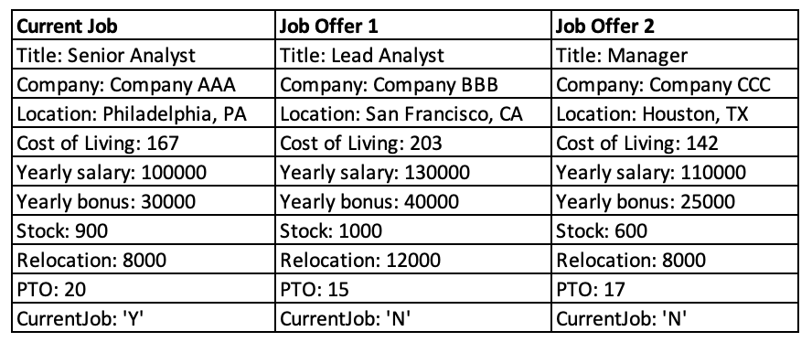
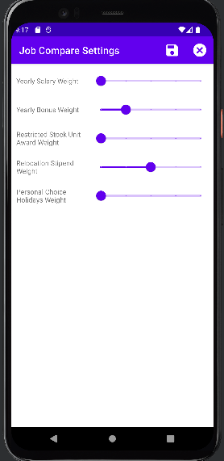
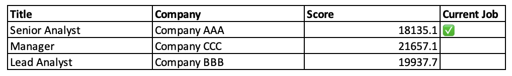
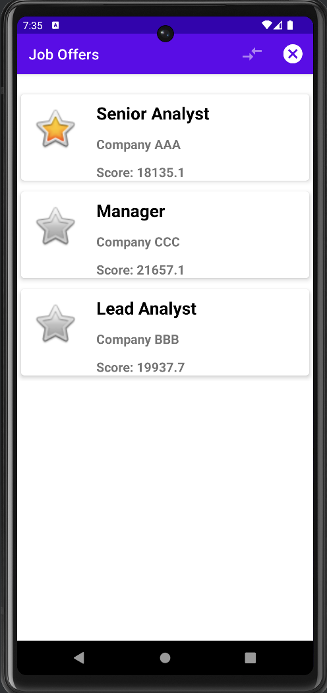
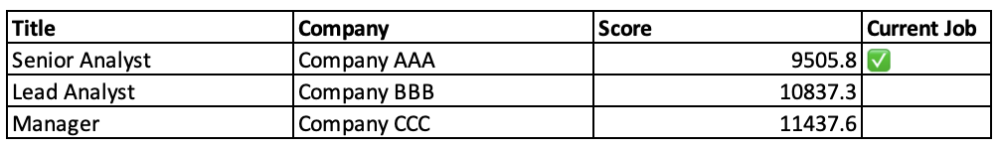
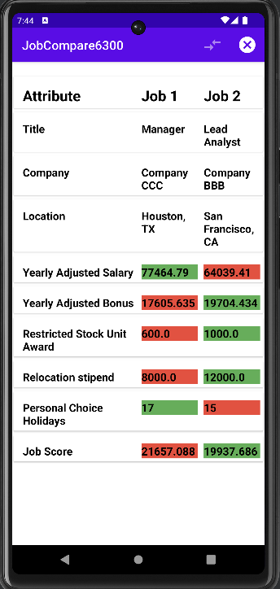
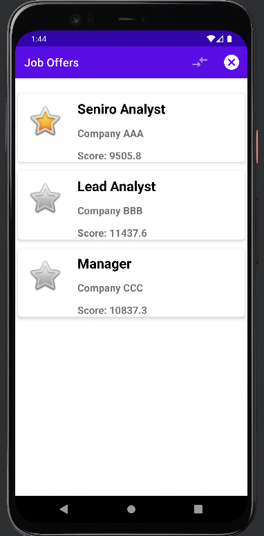
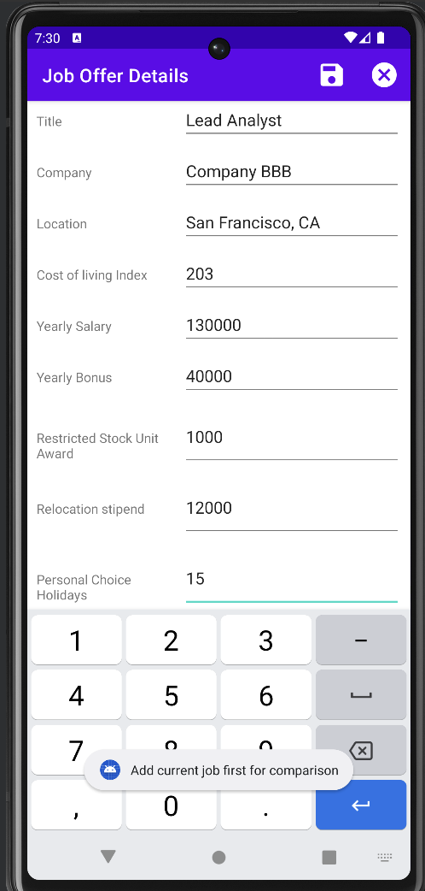

# Test Plan

**Author**: Puneeth, Feng, Yiliang, Alex

## 1 Testing Strategy

### 1.1 Overall strategy
Testing of the Job Comparison app will primarily be performed using a combination of white and black box testing, with additional unit level verification potentially provided by reviews and walkthroughs.
- Unit testing will be developed by class, with tests verifying intended functionality that is internal to said class. 
- Integration testing will focus on the compare job functionality and will assume jobs and settings are previously populated by the user. As the proposed system is relatively simple, this is the only integration test planned.
- System testing will cover the full system, emulating the user from first opening the app through successful job comparison. It will also include adjusting of the ComparisonSettings parameters prior to executing the comparison.
- Regression testing will use the full test suite defined for solution development which can be re-run and updated as additional features are requested and failures are resolved.

There will be significant overlap of integration testing and system testing based on the overall test strategy discussed here. As tests are developed, integration testing may be absorbed into system testing, with no subsystems remaining that warrant discrete integration testing.

### 1.2 Test Selection
For unit test, both black-box test and white-box test will be applied. 
- Black-box test is used to test whether each unit functions as expected and partition testing technique will be used to check whether the outputs are correct or whether the component can generate corresponding error messages when inputs do not meet the specified criteria. 
- White-box test is used to identify errors in the corresponding codes. Statement coverage technique will be used to examine all the statements in the code. 

For system test, black-box test will be applied to check whether the system meets the specified requirements. 
- Partition testing technique will be used to test whether the system generates correct results.
- State transition testing technique will be used to examine whether the system transit among pages as specified. 

### 1.3 Adequacy Criterion
All the model and controller classes will be tested using JUnit and the system/functional tests will be performed using UI testcases. The test cases should cover all requirements or functionalities of the system being tested including both positive and negative scenarios. Android code coverage report will be used to assess the quality of the test cases. 

### 1.4 Bug Tracking
GitHub projects will be used for bug tracking and managing enhancement requests. As this is a single user app, communication from the user will be direct to the development team with the Project Manager coordinating communication. Two projects have been created on the 6300Spring23Team057 repository for this purpose.

### 1.5 Technology
- JUnit/Mockito will be used for Unit testing
- Espresso will used for UI and System testing

## 2 Test Cases
### Test Cases (JUnit4, Espresso)

The below image is a set of test jobs referenced as "default test jobs" in the table of test cases.\

| Test Case # | Purpose                                                              | Scope                         | Inputs                                                                       | Steps                                                                                                                                                                                                                         | Implemented in Method                                                                                 | Expected Result                                                                                                                                                                    | Actual result                                                                                        | Pass / Fail |
|-------------|----------------------------------------------------------------------|-------------------------------|------------------------------------------------------------------------------|-------------------------------------------------------------------------------------------------------------------------------------------------------------------------------------------------------------------------------|-------------------------------------------------------------------------------------------------------|------------------------------------------------------------------------------------------------------------------------------------------------------------------------------------|------------------------------------------------------------------------------------------------------|-------------|
| 1           | Test getJobs()                                                       | ApplicationController         | default test jobs available in database                                      | 1. call getJobs()                                                                                                                                                                                                             | GetJobsTest.getJobsTest()                                                                             | list of job entities with three entries matching the three inputs, verified by checking title, company, and location                                                               | Match to expected                                                                                    | Pass        |
| 2           | Test getCurrentJob()                                                 | ApplicationController         | default test jobs available in database                                      | 1. call getCurrentJob()                                                                                                                                                                                                       | GetJobsTest.getCurrentJobTest()                                                                       | JobEntity 1 from list of inputs, verified by checking title, company, and location                                                                                                 | Match to expected                                                                                    | Pass        |
| 3           | Test addJob(...)                                                     | ApplicationController         | default test jobs available in database                                      | 1. Create a JobEntity instance for each input job 2. call addJob(JobEntity) for each input 3. call getJobs()                                                                                                           | TestUtilities.loadJobs()                                                                              | - JobEntity inputs in getJobs() return list - <=1 JobEntity with isCurrentJob = True                                                                                           | Match to expected                                                                                    | Pass        |
| 4           | Test removeJob(...)                                                  | ApplicationController         | default test jobs available in database                                      | 1. call removeJob(inputs) 2. call getJobs()                                                                                                                                                                               | TestUtilities.removeAllJobs()                                                                         | JobEntity(input) is not in getJobs() return                                                                                                                                        | Match to expected                                                                                    | Pass        |
| 7           | Enter and save a job offer                                           | Enter Job Offer               | None, default test job 1 information used                                    | 1. click "Enter Job Offer" 2. Input information into the form 3. Click the save button 4. Click return to main menu button  5. Call getJobs() 6. Verify a job exists with data matching the input information. | AddJobUITest.addJobTest()                                                                             | JobEntity in database with data matching the input information                                                                                                                     | Match to expected                                                                                    | Pass        |
| 8           | Enter incomplete job offer                                           | Enter Job Offer               | None, default test job 1 information used with title and company field empty | 1. From JobActivity enter job info with title and company field empty 2. Click save                                                                                                                                        | JobOfferUITest.testAddJobFieldErrors()                                                                | Error in the UI by blank fields with a relevant error message e.g "Job title cannot be empty"                                                                                      | Match to expected                                                                                    | Pass        |
| 10          | Cancel entering job offer                                            | Enter Job Offer               | None                                                                         | 1. Click cancel button                                                                                                                                                                                                        | Manual                                                                                                | Return to main menu, no data stored                                                                                                                                                | Match to expected                                                                                    | Pass        |
| 11          | Enter job offer and enter another                                    | Enter Job Offer               | None, default test job 1 and 2 used                                          | 1. Enter default test job 1 information 2. Click save button 3. Click "Enter another job offer" button 4. Enter default test job 2 information 5. Click save button                                               | Manual                                                                                                | Both jobs should be stored                                                                                                                                                         | Match to expected                                                                                    | Pass        |
| 12          | Check default comparison settings                                    | Adjust Comparison Settings    | None                                                                         | 1. Select Job compare settings from the main screen                                                                                                                                                                           |      JobComparisonUnitTest.testSettingsDefaultValue()                                                                                        | Settings are all set to 1                                                                                                                                                          | Match to expected                                                                                    | Pass        |
| 13          | Save comparison settings edit                                        | Adjust Comparison Settings    | None                                                                         | 1. Set new values for job comparison settings 2. Click save button                                                                                                                                                         | JobCompareUITest.testUpdateCompareSettingsAndSave()                                                             | Job comparison settings are updated to new values                                                                                                                                  | Match to expected                                                                                                | Pass        |
| 14          | Check loading of comparison settings to edit                         | Adjust Comparison Settings    | Comparison settings adjusted from default values                             | 1. Select Job compare settings from the main screen                                                                                                                                                                           | JobComparisonUITesting.testCompareSettingsSlider()                                                                                    | Modified job comparison settings shown to the user to edit                                                                                                                         |                        | Pass        |
| 15          | Present ranked list for all jobs saved when displaying job list      | Compare Jobs                  | default test jobs available in database                                      | 1.click on job offer compare button from main menu                                                                                                                                                                            | JobOffersActivityTest.testJobOffersRankedByScore()                                                    | display ranked list of tile and company for all saved jobs by descending scores and current job should be clearly indicated  |                                       | Pass        |
| 16sds       | Ensure current job is listed at the top of ranked list               | Compare Jobs                  | default test jobs available in database                                      | 1.click on job offer compare button from main menu                                                                                                                                                                            | JobOffersActivityTest.testCurrentJobOnTop()                                                           | display ranked list of tile and company for all saved jobs by descending scores and current job should be clearly indicated  |                                       | Pass        |
| 16          | Compare two job offers from the ranked list                          | Compare Jobs                  | default test jobs available in database                                      | 1.select two jobs from the list 2.click on compare button                                                                                                                                                                     | JobOffersActivityTest.testCompareJobOffersResults()                                                   |                                                                                                              |                 | Pass        |
| 17          | Enter job offer and compare with current                             | Enter Job Offer, Compare Jobs | default test jobs available in database                                      | 1. Enter job offer information 2. Save the job 3. Select the option to compare with current 4. Verify job comparison information                                                                                     | Manual                                                                                                |                                                                                         |  | Pass        |
| 18          | Test when no current job is entered/stored                           | Enter Current Job             | None                                                                         | Click on "Current Job" when no current job is entered.                                                                                                                                                                        | CurrentJobUITest.currentJobEmptyTest()                                                                | The current job screen is shown with all fields empty                                                                                                                              | Empty screen                                                                                         | Pass        |
| 19          | Test when there is a current job stored                              | Enter Current Job             | None                                                                         | Click on "Current Job" when there is one stored                                                                                                                                                                               | CurrentJobUITest.currentJobFilledTest()                                                               | The current job screen is shown with the appropriate information                                                                                                                   | Current job details shown                                                                            | Pass        |
| 20          | Test Save when a required field is incomplete                        | Enter Current Job             | Job details with incomplete field(s)                                         | Click on "Save" when not all required fields are complete                                                                                                                                                                     | CurrentJobUITest.emptySaveCurrentJobTest()                                                            | Error message popup                                                                                                                                                                | Error messages shown                                                                                 | Pass        |
| 21          | Test save when all fields are properly entered                       | Enter Current Job             | Job details with all fields properly entered                                 | Click on "Save" when all fields are entered properly                                                                                                                                                                          | CurrentJobUITest.testAddCurrentJob()                                                                  | Successfully saved to the database                                                                                                                                                 | Saved successfully                                                                                   | Pass        |
| 22          | Test Cancel                                                          | Enter Current Job             | None                                                                         | Click on "Cancel"                                                                                                                                                                                                             | Manual                                                                                                | Returned to main menu, no information is changed in the database                                                                                                                   | Returned to main menu                                                                                | Pass        |
| 25          | Ranked list updated with modified weight settings for job comparison | Compare Jobs                  | default test jobs available in database, Comparison Settings: (1,1,5,5,1)    | 1. change the comparison settings and save   2.click on job offer compare button from main menu                                                                                                                            | JobOffersAcitivityTest.testCompareJobOffersWithUpdatedSettings()                                                                                           | list of jobs re-ranked by updated score                                                                                      |                                       | Pass        |
| 26          | Return to main menu from result page of compare job                  | Compare Jobs                  | None                                                                         | click on cancel button on the result page                                                                                                                                                                                     | JobOffersAcitivityTest.testCompareJobOffersAndCancel()                                                                                             | return to main menu                                                                                                                                                                | Return to main menu                                                                                  | Pass        |
| 27          | Perform another job offer comparison from result page of compare job | Compare Jobs                  | None                                                                         | click on job compare button on the result page                                                                                                                                                                                | JobOffersActivityTest.testCompareJobOffersAndPerformAnotherCompare()                                  | return to ranked list of all jobs                                                                                                                                                  | Return to ranked list of all jobs                                                                    | Pass        |
| 28          | Compare the entered job offer without current job saved              | Compare Jobs                  | None                                                                         | click on compare button from job offer page (no current job saved)                                                                                                                                                            | Manual                                                                                                | show message: "add current job for comparison"                                                                                                                                     |                | Pass        | 
| 30juu       | Select more than 2 or only 1 jobs for comparison                     | Compare Jobs                  | None                                                                         | select more than 2 or only 1 job in job comparison page                                                                                                                                                                       | JobOffersActivityTest.testSelectOnlyOneJobOffer() JobOffersActivityTest.testSelectThreeJobOffers() | comparison button greyed out                                                                                                                                                       | Comparison button greyed out                                                                         | Pass        | 
| 31          | Edit job offer from comparison page                                  | Compare Jobs                  | None                                                                         | click on job offer                                                                                                                                                                                                            | JobOffersAcitivityTest.testEditJobOfferFromRankedList()                                                                                        | go to job offer page                                                                                                                                                               | Match to expected                                                                                                   | Pass        |
| 32          | Edit current job from comparison page                                | Compare Jobs                  | None                                                                         | click on current job                                                                                                                                                                                                          | JobOffersAcitivityTest.testEditCurrentJobFromRankedList()                                                                                       | go to current job page                                                                                                                                                             | Match to expected                                                                                                | Pass        |
| 3           | Cancel job comparison                                                | Compare Jobs                  | None                                                                         | 1. Click the cancel button                                                                                                                                                                                                    | Manual                                                                                                | Return to the main menu                                                                                                                                                            | Match to expected                                                                                    | Pass        |
|             | Enter current job activity launch                                    | ApplicationController         | None                                                                         | 1. Click "Enter Current Job"                                                                                                                                                                                                  | MainActivityUITest.testCurrentJobActivityLaunch()                                                     | Show "Enter Current Job" activity                                                                                                                                                  | Match to expected                                                                                    | Pass        |
|             | Enter job offer activity launch                                      | ApplicationController         | None                                                                         | 1. Click "Enter Job Offer"                                                                                                                                                                                                    | MainActivityUITest.testJobOfferActivityLaunch()                                                       | Show "Enter Job Offer" activity                                                                                                                                                    | Match to expected                                                                                    | Pass        |
|             | Compare job offers activity launch                                   | ApplicationController         | None                                                                         | 1. Click "Compare Job Offers"                                                                                                                                                                                                 | MainActivityUITest.testJobOffersActivityLaunch()                                                      | Show "Compare Job Offers" activity                                                                                                                                                 | Match to expected                                                                                    | Pass        |
|             | Adjust comparison settings activity launch                           | ApplicationController         | None                                                                         | 1. Click "Adjust Comparison Settings"                                                                                                                                                                                         | MainActivityUITest.testJobCompareActivityLaunch()                                                     | Show "Adjust Comparison Settings" activity                                                                                                                                         | Match to expected                                                                                    | Pass        |