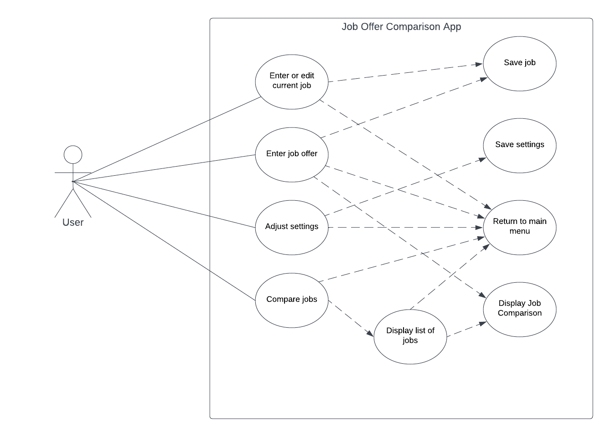

# Use Case Model

**Author**: ychen3647

## 1 Use Case Diagram

## 2 Use Case Descriptions

Enter or Edit Current Job

- *Requirements: Allow the user to add or edit their current job details*
- *Pre-conditions: The main menu is displayed and the user clicks on "Enter/Edit Current Job"*
- *Post-conditions: The current job is saved to the database, user is returned to main menu*
- *Scenarios:*
  - *1. Main menu display*
  - *2. User clicks on "Enter/Edit Current Job"*
  - *3. Job edit screen is displayed*
  - *4. User enters job details*
  - *5. User clicks "Save" or "Cancel"*
  - *6. Job is saved if user clicked "Save", return to main menu regardless*

Enter Job Offers

- *Requirements: Allow user to enter 1 or more job offers*
- *Pre-conditions: The main menu is displayed and the user clicks on "Enter Job Offer(s)"*
- *Post-conditions: The job offer is saved to the database*
- *Scenarios:*
  - *1. Main menu display*
  - *2. User clicks on "Enter Job Offer(s)"*
  - *3. Job edit screen is displayed*
  - *4. User enters job details*
  - *5. User clicks "Save" or "Cancel"*
  - *6. If User clicked "Save", display another popup/screen asking whether user wants to "Add another job", "Return to main menu" or "Compare this job to current job", if user clicked "Cancel", return to main menu*

Adjust Settings
- *Requirements: Allow user to adjust job weight settings*
- *Pre-conditions: The main menu is displayed and the user clicks on "Adjust Settings"*
- *Post-conditions: The new settings are saved*
- *Scenarios:*
  - *1. Main menu display*
  - *2. User clicks on "Adjust Settings"*
  - *3. Settings screen is displayed*
  - *4. User enters settings*
  - *5. User clicks "Save" or "Cancel"*
  - *6. Save settings if the user clicked "Save", return to main menu regardless*

Compare Jobs
- *Requirements: Allow user to select and compare 2 job offers or 1 current job vs 1 job offer*
- *Pre-conditions:*
  - *1. There are at least 1 current job and 1 job offer, or 2 job offers*
  - *2. The main menu is displayed and the user clicks on "Compare Jobs" or User saved a job offer and clicks on "Compare this job to current job"*
- *Post-conditions: The job comparison screen is displayed*
- *Scenarios:*
  - *1. Main menu displayed and user clicks "Compare Jobs" or user clicks "Compare this job to current job" directly after entering a job offer*
  - *2. If from main menu, display list of all jobs ranked*
  - *3. If list is displayed, user selects 2 job offers*
  - *4. Display the job comparison screen*